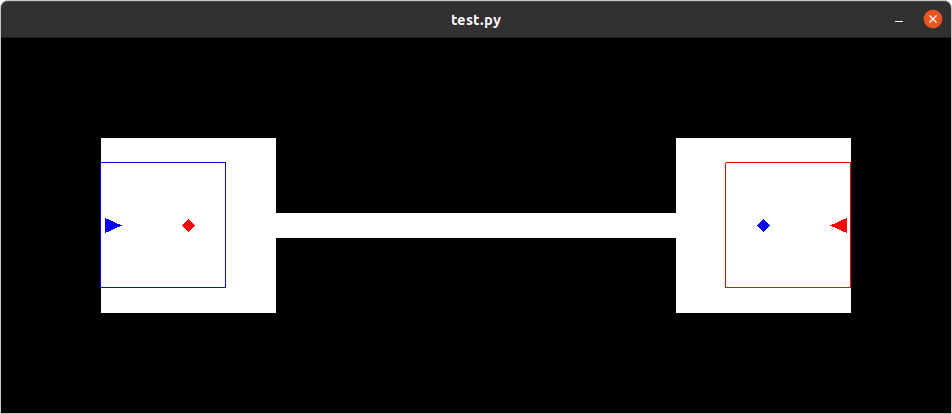
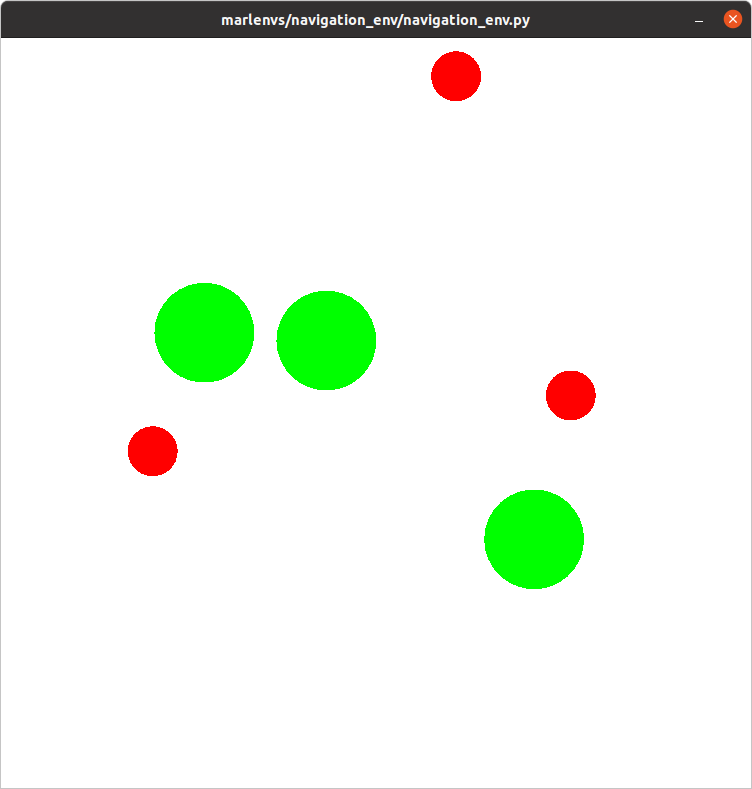

# MARLenvironments
Multi-Agent environments for [OpenAI Gym](https://github.com/openai/gym).

# Installation
To install, use 
```
pip install marlenvs
```
Then just 
```python
import gym
import marlenvs
```

### Requires:
  - gym
  - numpy
  - python version >= 3.9

# Environments

## Two-Step Environment
Very simple tabular environment which appears in [QMIX: Monotonic Value Function Factorisation for Deep Multi-Agent Reinforcement Learning](https://arxiv.org/abs/1803.11485). First agent decides which out of two games to play. The agents then pick an action (0 or 1) for the one-round game and receive a shared reward.

```python
env = gym.make('TwoStep-v0')
```

## Switch-Corridor Environment
This environment appears in [Value-Decomposition Networks For Cooperative
Multi-Agent Learning](https://arxiv.org/pdf/1706.05296.pdf). Two agents try to reach a switch in the other room but can't fit through the corridor simultaneously. They observe their environment only partially through a maximum-range view.

<p align="left">
  
</p>

```python
env = gym.make('Switch-v0')
```

## Navigation Environment
This environment appears in [Multi-Agent Actor-Critic for Mixed Cooperative-Competitive Environments](https://arxiv.org/pdf/1706.02275). N circle shaped agents move in a 2D-environment by choosing from two continous actions: Distance to travel ∈ [0, 1] where 1 is an agent diameter and direction ∈ [-π, π).
They are rewarded for covering N circular landmarks and for not colliding. The way in which this is done can be changed.

<p align="left">
  
</p>

```python
env = gym.make('Navigation-v0', n_agents=3)
```


